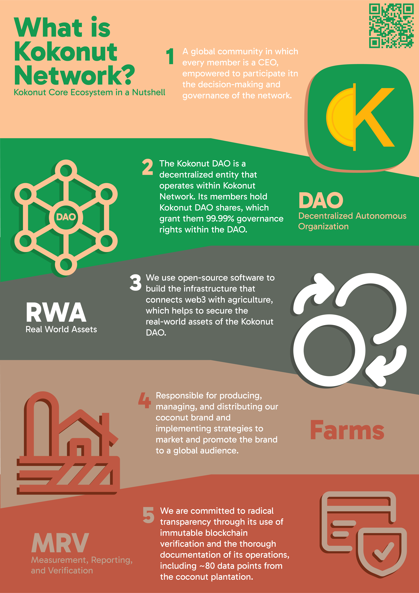

# DAO Layers

<figure><figcaption></figcaption></figure>

> Our DAO Thesis is powered by 5 Layers that aim to provide stability to the network ⚖️🧬

#### Governance Layer

This layer is composed of Kokonut DAO members. They oversee and vote on proposals that benefit the Kokonut Ecosystem. Anyone who holds at least one Kokonut DAO token can participate in DAO governance.

#### Logic Layer

This layer is where the [DAO Treasury](https://link.kokonut.network/treasury), list of token holders, funding, and membership proposals live securely.

#### Execution Layer

After approval by Kokonut DAO members, this layer functions as the body responsible for executing the budget and work plan. It comprises the [Core Team](https://kokonut.network/about), Kokonut DAO Contributors, and Global & Local Partners.

#### Production Layer

**This is where the magic happens!** In this layer, we bring our mission to life: producing and distributing Coconuts and derivative products globally. Kokonut V1 is our first commercial-grade farm to be funded via Kokonut DAO.
